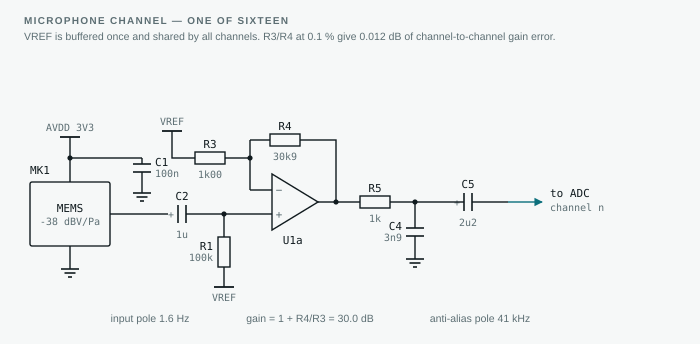
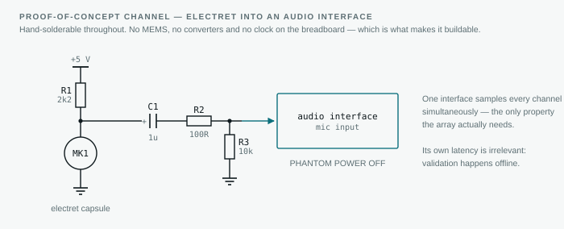
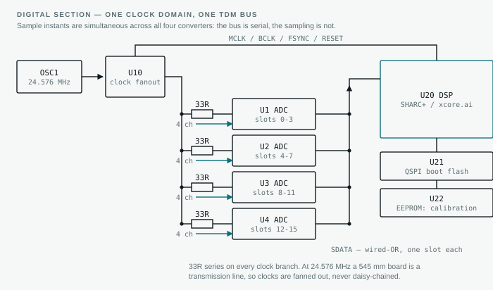
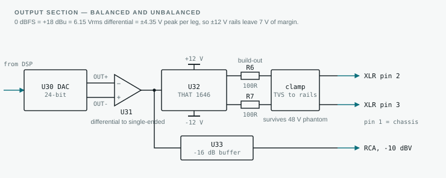
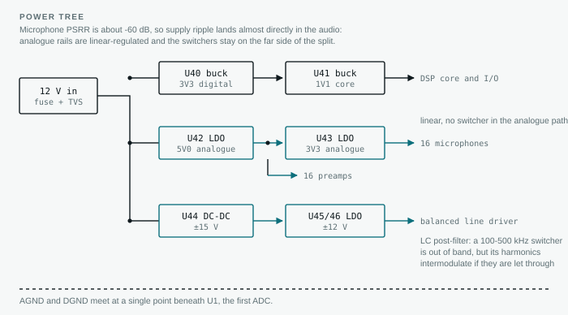

# Low-Latency Talker-Tracking Microphone Line Array

A 16-channel steered line array that locks onto whoever is talking, delivers a
balanced line-level feed, and does it in **1.4 ms** from diaphragm to XLR pin 2.

Every number in this document is produced by
[`tools/mic_line_array_design.py`](../tools/mic_line_array_design.py) — run it to
regenerate them. Nothing here is a rule of thumb; the beamformer figures are
measured from the *truncated* FIR bank that would actually run on the DSP, not
from idealised frequency-domain weights.

---

## Programme at a glance

| Phase | Build | Cost | Time | What it retires |
|---|---|---|---|---|
| 0 | Design and software verification | **done** | — | Filter synthesis, parameter choice, predicted performance |
| 1 | 8-channel acoustic proof of concept (§13.3) | ~$350 | 2 wk | Does beamforming and talker tracking work in a real room |
| 2 | 16-channel full-aperture proof of concept (§13.4) | ~$600 | 3 wk | Full directivity, low-frequency superdirectivity |
| 3 | Latency bench, converter eval boards (§13.4) | ~$200–400 | 1 wk, parallel | The 0.63 ms allocation — the largest unknown in the headline spec |
| 4 | Engineering prototype (§11, §12.3) | 38.5 person-weeks + ~$6–12k NRE | 5–6 mo | Manufacturability, real self-noise, real latency |
| 5 | Production (§12.2) | $133/unit at 1000 | 12–16 min/unit | — |

**Phases 1–3 are the whole point.** Six weeks and about $1,150 buys the first
genuine go/no-go, and de-risks a 5–6 month engineering programme before it starts.
They need no custom hardware: electret capsules on a drilled strip, a multichannel
audio interface, and offline processing with the tool in this repository.

Total elapsed to a validated first article is **7–8 months** running the proof of
concept first, or 5–6 if phases 1–3 overlap the start of phase 4. Non-labour NRE
(prototype boards and assembly setup, the calibration coupler, enclosure tooling)
is roughly $6–12k; engineering labour dominates it several times over.

---

## 1. The brief, as interpreted

| Requirement | What it was taken to mean |
|---|---|
| "microphone line array" | A linear (1-D) array — resolves bearing along one axis, mounted on a wall, table edge or above a display |
| "finds the primary talker" | Fully automatic: no operator, no presets. Localise, decide who is *primary*, steer, and hand over cleanly when someone else takes the floor |
| "minimum delay" | Latency is a first-class design constraint, budgeted term by term and traded against directivity explicitly — not whatever falls out of a convenient DSP structure |
| "line level for output" | Calibrated, standards-compliant analogue output: balanced +4 dBu with real headroom, plus unbalanced −10 dBV |

Two consequences that shape everything below:

- **Minimum delay rules out the obvious architecture.** The textbook broadband
  beamformer runs in the STFT domain. A 512-point frame at 16 kHz costs 32 ms of
  algorithmic latency *before* any filtering — 23× this entire signal chain. The
  beamformer here is therefore time-domain FIR throughout.
- **Steering must not be continuous.** Re-deriving filter coefficients per frame
  makes latency and stability a function of the tracker. Instead a fixed bank of
  34 pre-computed beams is stored, two run in parallel, and steering is a
  cross-fade between them — which adds exactly zero delay.

---

## 2. Headline specification

| Parameter | Value |
|---|---|
| Microphones | 15 in the array + 1 rear-facing reference = 16 ADC channels |
| Aperture | 513.6 mm |
| Coverage | ±75° from broadside, 34 beams |
| Bandwidth | 120 Hz – 8 kHz (wideband speech) |
| **Latency, mic to line out** | **1.42 ms** above 3 kHz; 2.21 ms below 250 Hz |
| Directivity index | 9.5 dB mean (200 Hz – 7 kHz), 11.9 dB at 6.3 kHz |
| A-weighted room-noise rejection | 6.1 dB |
| A-weighted self-noise | 19 dBA SPL equivalent at the beam output |
| On-axis response flatness | ±0.5 dB (1.00 dB peak-to-peak) |
| White-noise gain | ≥ −0.4 dB at all frequencies and all beams |
| Talker localisation | 0.06° median error (quiet), 0.27° at 5 dB SNR |
| Hand-over time | 160 ms to lock onto a new talker |
| Output | +4 dBu balanced (+18 dBu clip) / −10 dBV unbalanced |
| Compute | 329 MMAC/s, 382 kB coefficient storage |

---

## 3. What a line array cannot do

Stating this up front, because it constrains where the product can be mounted:

- **Cone ambiguity.** A linear array measures only the angle to the array *axis*.
  Every source on a cone around that axis produces identical inter-microphone
  delays. In a plane this collapses to a front/back mirror: θ and 180° − θ are
  indistinguishable.
- **No elevation.** A talker standing and the same talker seated at the same
  bearing are the same signal.
- **No range.** Two talkers on the same bearing at different distances cannot be
  separated at all.

Mitigations, in order of cost: mount the array against a wall, table edge or
display bezel so the rear hemisphere is physically baffled; use the 16th
(rear-facing) microphone as a front/back discriminator and as a noise reference;
and if genuine 2-D coverage is needed, this design is the row element of an L or
cross array — the beamformer maths below is unchanged, only the steering
manifold grows.

---

## 4. Geometry

Base grid pitch **21.4 mm = λ/2 at 8 kHz**. This is the binding spatial-sampling
constraint: for steering to ±75° without a grating lobe entering visible space,
the pitch must satisfy `d ≤ λ / (1 + sin θmax)` = 42.88 / 1.966 = **21.8 mm**, so
21.4 mm holds with a little margin.

Element positions are chosen so that three *uniform* octave sub-arrays are
embedded in one 15-element aperture and share elements:

| Sub-array | Elements | Pitch | Aperture | Alias-free to |
|---|---|---|---|---|
| LF | 7 | 85.6 mm | 513.6 mm | 2004 Hz |
| MF | 7 | 42.8 mm | 256.8 mm | 4007 Hz |
| HF | 7 | 21.4 mm | 128.4 mm | 8014 Hz |

Positions, mm from centre:

```
-256.8  -171.2  -128.4  -85.6  -64.2  -42.8  -21.4   0
  +21.4  +42.8   +64.2  +85.6 +128.4 +171.2 +256.8
```

**The nesting is a spatial-sampling guarantee, not a runtime band split.** The
beamformer uses all 15 elements at every frequency; the optimiser decides the
weighting and naturally de-emphasises the widely-spaced outer elements at high
frequency. The nested positions simply guarantee that *some* adequately-sampled
sub-aperture exists in every octave, so the optimiser is never asked to do the
impossible. The measured pattern confirms it works: peak sidelobe −13.7 dB and
mean off-lobe rejection −21.7 dB at 6.3 kHz, with no grating lobe anywhere.

At the other end, 513.6 mm is only 0.37 λ at 250 Hz. No amount of aperture
shading gives useful directivity from a third of a wavelength — which is why the
beamformer below is superdirective rather than delay-and-sum, and why its
robustness constraint matters so much.

---

## 5. Signal chain

```
 15x analog MEMS       16-ch                    fixed-point / float DSP
    ┌────────┐      ┌──────────┐   TDM    ┌───────────────────────────────┐
    │  mic   ├─30dB─┤          │          │  per-mic calibration FIR (7)  │
    │  x15   │      │  2x 8-ch ├─────────►│              │                │
    └────────┘      │   ADC    │  48 kHz  │       ┌──────┴──────┐         │
    ┌────────┐      │  24-bit  │  shared  │       │             │         │
    │rear ref├─30dB─┤          │  MCLK    │  beam[k] FIR   beam[k'] FIR   │
    └────────┘      └──────────┘          │   15x192        15x192        │
                                          │       └──────┬──────┘         │
                                          │        cross-fade (30 ms)     │
                                          │              │                │
                                          │      AGC / limiter (0 look)   │
                                          │              │                │
                          ┌───────────────┤   SRP-PHAT ──┘  (16 ms hop)   │
                          │  decimate     │   talker tracker              │
                          │  to 16 kHz    └───────────────────────────────┘
                          └───────────────────────────┐
                                                      ▼
                                        ┌──────────┐    ┌─────────────┐
                                        │   DAC    ├───►│  balanced   ├──► XLR  +4 dBu
                                        │  24-bit  │    │ line driver ├──► RCA  -10 dBV
                                        └──────────┘    └─────────────┘
```

The localisation path is deliberately **off the audio path**. It runs at 16 kHz
on 32 ms frames — 32 ms of analysis latency that costs nothing, because it only
selects which pre-computed beam is active. The audio never passes through it.

---

## 6. Beamformer

### 6.1 Formulation

Stack every FIR tap into one vector `h`, with `h[(m,n)] = h[m·L + n]` for
microphone `m` and tap `n`. The array's response to a plane wave from θ₀ is then
linear in `h`:

```
R(f) = a(f)ᵀ h ,      a(f)[(m,n)] = d_m(f) · e^{-j2πf n / fs}
```

The design is a single regularised least-squares problem:

```
minimise   Σ_f w_f |a(f)ᵀh − t(f)|²        response fit
         + γ Σ_f u_f · hᵀ Re(Eᴴ Γ(f) E) h  diffuse-field output noise power
         + ρ Σ_f u_f · hᵀ Re(Eᴴ E) h       white (self-) noise output power
```

with target `t(f) = S(f)·e^{-j2πf·τ(f)}` — the intended band shape `S` carrying
the intended group delay `τ`. Γ(f) is the spherically-isotropic coherence
`sinc(2fd/c)`.

Three things make this practical:

- **The normal-equation matrix is block-Toeplitz.** Every (m,m′) block depends
  only on the tap lag `n − n′`, so the 2880 × 2880 system is assembled from 1-D
  kernels of length 2L−1 rather than a triple loop. Build time is ~1 s.
- **γ is the directivity knob, ρ is the robustness knob.** γ = 0 gives plain
  delay-and-sum; increasing γ buys directivity and spends on-axis flatness. ρ
  sets the white-noise gain floor directly.
- **`u_f` must be non-zero at every frequency, including outside the output
  band.** This is the trap. Where the noise weight is zero, the individual
  channel gains are unconstrained — the fit only requires that they *cancel* on
  axis, and the superdirective solution happily makes them enormous and
  opposite. Costs nothing on paper; in the first version of this design it
  produced tens of dB of out-of-band self-noise gain and zero tolerance to
  mismatch. Holding `u_f` at 0.25 outside the band fixes it.

Operating point: **γ = 0.1, ρ = 0.01, L = 192 taps at 48 kHz** (4.00 ms span).

### 6.2 Frequency-dependent group delay

The single most important latency decision. The target delay τ(f) is **not**
constant: 1.50 ms below 200 Hz, tapering to 0.70 ms above 3 kHz.

Two independent reasons, and they agree:

1. **Aperture crossing is a hard physical floor.** Any beamformer that coherently
   sums an aperture `A` steered at θ must wait for the wavefront to cross it:
   `A·sin θ / c`. At ±75° the full 513.6 mm LF aperture needs
   `0.5136 × sin 75° / 343` = **1.45 ms** — so τ_LF = 1.50 ms is that floor plus
   margin, not an arbitrary choice. But high frequencies only use the inner
   128.4 mm sub-aperture, needing just 0.36 ms. Forcing HF to wait for the LF
   aperture would throw away a millisecond for nothing.
2. **The ear tolerates delay unevenly.** Blauert & Laws put the audibility
   threshold for group delay at roughly 1.6 ms at 8 kHz, 2 ms at 4 kHz, 3.2 ms at
   1 kHz and 10 ms at 500 Hz. Spending delay where it is both *needed* and
   *inaudible* is free.

The taper must be gentle. A steep dτ/df is an all-pass a short FIR cannot
realise, and it is paid for in on-axis ripple: an early attempt at
1.6 ms → 0.35 ms over 250–2000 Hz produced **7.5 dB** of ripple. The shipped
1.50 → 0.70 ms over 200–3000 Hz produces **1.00 dB**.

### 6.3 Measured performance, broadside beam

| f (Hz) | DI (dB) | WNG (dB) | Group delay (ms) | On-axis (dB) | DI, delay-and-sum |
|---|---|---|---|---|---|
| 125 | 0.8 | −1.4 | 1.51 | −0.44 | 0.1 |
| 250 | 2.6 | 0.3 | 1.42 | −0.64 | 0.5 |
| 500 | 4.1 | 5.1 | 0.84 | −0.27 | 1.7 |
| 1000 | 6.2 | 8.0 | 0.54 | −0.23 | 4.3 |
| 2000 | 8.5 | 10.4 | 0.53 | −0.07 | 7.3 |
| 4000 | 10.5 | 11.0 | 0.70 | −0.07 | 9.9 |
| 6300 | 11.9 | 11.2 | 0.70 | −0.05 | 11.5 |

Mean DI 200 Hz – 7 kHz: **9.54 dB**, against 8.56 dB for delay-and-sum on the
same array. Superdirectivity is worth about 1 dB broadband — and about 2 dB
across 250 Hz – 1 kHz, peaking at 2.4 dB near 500 Hz, which is where room noise
actually lives.

Beamwidth and sidelobes:

| f (Hz) | −6 dB beamwidth | Peak sidelobe | Mean off-lobe |
|---|---|---|---|
| 250 | 94° | −13.3 dB | −15.4 dB |
| 500 | 58° | −7.4 dB | −12.8 dB |
| 1000 | 34° | −13.3 dB | −18.9 dB |
| 2000 | 20° | −13.1 dB | −21.0 dB |
| 4000 | 10° | −10.6 dB | −20.6 dB |
| 6300 | 8° | −13.7 dB | −21.7 dB |

A superdirective design minimises *integrated* diffuse noise, so it places deep
nulls at particular angles rather than a smooth taper. The mean off-lobe column
is the meaningful figure; any single angle is not.

### 6.4 Steering

| Steered to | Mean DI | Ripple | Worst WNG | Group delay (HF) |
|---|---|---|---|---|
| 0° | 9.54 dB | 1.00 dB | −0.4 dB | 0.70 ms |
| 25° | 9.42 dB | 0.82 dB | 2.9 dB | 0.70 ms |
| 45° | 9.35 dB | 0.60 dB | 4.6 dB | 0.70 ms |
| 60° | 9.67 dB | 0.52 dB | 3.7 dB | 0.70 ms |
| 75° | 12.07 dB | 0.50 dB | 2.2 dB | 0.70 ms |

DI *rises* toward endfire — the main lobe narrows in the steering plane and the
ambiguity cone shrinks. More importantly, **group delay is identical for every
beam**, so a beam switch produces no timing step, only a gain cross-fade.

### 6.5 Beam grid

Beams are spaced uniformly in `u = sin θ`, not in angle — that is what keeps the
main lobe a constant width across coverage.

| Beam spacing Δu | Beams over ±75° | Worst cross-over loss |
|---|---|---|
| 0.06 | 34 | 1.16 dB |
| 0.10 | 21 | 3.23 dB |
| 0.15 | 14 | 7.74 dB |

**34 beams** chosen: a talker anywhere in coverage is within 1.2 dB of a beam
centre. Storage is 34 × 15 × 192 × 4 B = 382 kB.

### 6.6 Tolerance

300-trial Monte-Carlo with per-microphone gain 0.5 dB, phase 2°, position 0.3 mm
(1σ), evaluated on a steered beam as well as at broadside:

| Beam | Nominal DI | Mean DI | 5th-pct DI | Dev. p95 | Dev. worst |
|---|---|---|---|---|---|
| Broadside | 9.54 dB | 9.53 dB | 9.52 dB | 0.99 dB | 1.58 dB |
| Steered 75° | 12.07 dB | 12.03 dB | 11.99 dB | 0.55 dB | 1.12 dB |

**Both rows are needed, and an earlier version of this document reported only the
first.** Position error along the array axis is *invisible* at broadside: a plane
wave arriving normal to the array reaches every element simultaneously however the
elements happen to be spaced. A broadside-only sweep therefore tests gain and
phase and silently ignores position, which is not what it appears to be doing.
The error appears as sin θ grows — 1 mm of axial displacement is 4.2° of phase at
8 kHz steered to 30°, and 8.1° steered to 75°.

Position sensitivity, measured properly on the 75° beam with gain and phase held
perfect:

| Position 1σ | Mean DI | 5th-pct DI | On-axis dev. p95 |
|---|---|---|---|
| 0.3 mm | 12.07 dB | 12.02 dB | 0.11 dB |
| 0.5 mm | 12.06 dB | 11.99 dB | 0.17 dB |
| 1.0 mm | 12.04 dB | 11.88 dB | 0.37 dB |
| 2.0 mm | 11.97 dB | 11.63 dB | 0.90 dB |
| 4.0 mm | 11.69 dB | 10.93 dB | 2.53 dB |

The conclusion survives the correction, and is stronger for being tested: the
array is remarkably insensitive to position. The ±0.3 mm build tolerance in §11.2
is set by what a single PCB gives away free, not by what the beamformer needs —
even ±1 mm costs 0.03 dB of directivity. This is the whole point of constraining
white-noise gain rather than chasing maximum DI. An unconstrained superdirective
design on this aperture reaches higher DI on paper and falls apart on the bench.

Gain and phase are where the sensitivity actually lives:

| Per-mic error | Mean DI | On-axis dev. p95 |
|---|---|---|
| 0.5 dB / 2° (calibrated) | 12.03 dB | 0.55 dB |
| 1 dB / 5° (good capsule, uncalibrated) | 11.88 dB | 1.26 dB |
| 2 dB / 10° (cheap electret, uncalibrated) | 11.33 dB | 2.68 dB |
| 3 dB / 15° (worst case) | 10.51 dB | 4.33 dB |

Which is the quantitative case for §11.7's calibration step: it is worth roughly
1.5 dB of directivity and 2 dB of response flatness, and no amount of care with
the mechanical build substitutes for it.

---

## 7. Latency

| Stage | Delay | Notes |
|---|---|---|
| Mic + preamp + anti-alias | 0.02 ms | analogue, 1st order at 40 kHz |
| ADC decimation filter | 0.35 ms | **budget allocation — verify on the datasheet** |
| Calibration FIR, 7 tap | 0.07 ms | per-mic gain/phase trim |
| Beamformer FIR, above 3 kHz | 0.70 ms | *measured* from the FIR bank |
| Beam cross-fade | 0.00 ms | two beams in parallel |
| AGC / limiter | 0.00 ms | zero look-ahead, soft knee |
| DAC reconstruction filter | 0.28 ms | **budget allocation — verify on the datasheet** |
| Balanced line driver | 0.00 ms | analogue |
| **Total, speech band above 3 kHz** | **1.42 ms** | |
| Total, band below 250 Hz | 2.21 ms | inaudible per §6.2 |

Notes on the two largest terms:

- **The converters, not the DSP, dominate.** 0.63 ms of the 1.42 ms is ADC + DAC
  decimation/interpolation filtering. These two figures are *allocations*, not
  measurements — they assume the chosen converters offer a short-group-delay
  filter mode and that it is enabled. Confirm this before committing to parts;
  a converter in default linear-phase mode can be 3–5× worse and would dominate
  the budget on its own.
- **The AGC has no look-ahead.** A look-ahead limiter is the conventional choice
  and would add 0.3–1 ms. Instead: soft-knee compression with a fast release and
  a hard clip guard, accepting a few tenths of a dB of transient overshoot rather
  than paying for it in latency on every sample.
- **1.42 ms is 0.49 m of air.** For reinforcement into the same room, the array
  is acoustically closer to the listener than a loudspeaker half a metre away —
  the Haas-effect budget is essentially untouched.

---

## 8. Finding the primary talker

### 8.1 Localisation

SRP-PHAT on the 16 kHz path: 32 ms Hann frames, 16 ms hop, 300–3800 Hz, over a
65-point angular grid, with a parabolic fit through the peak for sub-grid
resolution. Rather than summing all 105 microphone-pair cross-spectra per
direction, the identity

```
Σ_{i<k} Re(x_i x_k* e^{-jω(τ_i-τ_k)}) = ( |Σ_i x_i d_i*|² − M ) / 2      (|x_i| = 1 after PHAT)
```

gives identical values in O(M) instead of O(M²) per direction.

| Scenario | Median error | Frames > 5° |
|---|---|---|
| Quiet room, single talker | 0.06° | 0.0 % |
| Noisy room, 5 dB SNR | 0.27° | 0.0 % |
| Competing talker 6 dB down | 0.17° | 14.5 % |
| Competing talker 3 dB down | 0.25° | 28.2 % |

The median is excellent throughout; the interesting column is the right-hand
one. With a competing talker only 3 dB down, more than a quarter of frames point
at the *wrong person*. Per-frame localisation is not talker tracking.

### 8.2 The tracker

Which is why the raw peak never steers anything. Between SRP-PHAT and the beam
bank sits a hysteretic state machine:

- Per-beam scores smoothed with a 120 ms time constant.
- A per-beam noise floor tracked with a 5 s running minimum and subtracted —
  this is what stops HVAC, a projector fan or a laptop on the table from being
  "the talker".
- A challenger must beat the held beam by **3 dB continuously for 150 ms**
  before the beam moves.
- 400 ms hangover after speech offset, so the beam does not wander during
  natural pauses.
- Beam changes cross-fade over 30 ms between the two running beamformers.

Measured on a turn-taking scenario — talker A at −35° for 3 s, then talker B at
+40°:

| | Result |
|---|---|
| Beam correctly on A before hand-over | 100 % of frames |
| Time to lock onto B | 160 ms |
| Total beam switches in 6 s | 1 |

One switch, where one switch was warranted. The 160 ms is essentially the
150 ms hysteresis window — i.e. the tracker is as fast as it is allowed to be,
and the trade is explicit and tunable rather than emergent.

---

## 9. Noise: two different gains

The classic error in superdirective array design is to quote the directivity
index and imply it applies to all noise. It does not:

- **Room noise** is close to a diffuse (spherically isotropic) field. The array's
  gain against it is the **directivity index**.
- **Microphone self-noise** is uncorrelated between elements. The array's gain
  against it is the **white-noise gain** — which a superdirective design drives
  *negative* at low frequency.

They move in opposite directions. A design tuned only on DI quietly trades a few
dB of room noise for a hiss that cannot be removed downstream.

A-weighted over the 120 Hz – 8 kHz output band, referenced to a single omni
microphone through the same band shaping:

| | This design | Delay-and-sum |
|---|---|---|
| Gain against diffuse room noise | **+6.1 dB** | +3.9 dB |
| Effect on mic self-noise | **−10.2 dB** | −11.8 dB |

Superdirectivity buys 2.2 dB more room-noise rejection and gives back 1.6 dB of
self-noise benefit. Since mic self-noise is 29 dBA and a real room is 40–45 dBA,
room noise dominates and the trade is clearly worth taking — but it is a trade,
and ρ is the knob if a quieter room or a noisier microphone changes the balance.

---

## 10. Output stage and gain staging

### 10.1 Acoustic to digital

| Point | Value |
|---|---|
| Mic sensitivity / self-noise / AOP | −38 dBV/Pa, 29 dBA, 130 dB SPL |
| Preamp gain | 30 dB |
| SPL at ADC full scale | 108 dB SPL |
| Quiet room noise floor, 45 dB SPL | −63.0 dBFS/mic |
| Far talker at 3 m, 55 dB SPL | −53.0 dBFS/mic |
| Normal talker at 1.5 m, 65 dB SPL | −43.0 dBFS/mic |
| Loud/close talker, 85 dB SPL | −23.0 dBFS/mic |
| Mic self-noise, one channel | −79.0 dBFS |
| Mic self-noise, beam output | −89.2 dBFS (= 19 dBA SPL equivalent) |
| 45 dBA room noise, beam output | −69.1 dBFS (= 39 dBA SPL equivalent) |
| Talker-to-room-noise at output | 26.1 dB (single mic: 20 dB) |

The 30 dB preamp gain puts ADC clip at 108 dB SPL — 22 dB below the
microphone's acoustic overload point, so the converter clips first and does so
gracefully. The system is microphone-noise-limited, not converter-limited
(−79 dBFS mic noise against roughly −110 dBFS for a 24-bit converter), which is
the right place to be: it means analogue gain can stay conservative and the rest
of the range can be taken digitally in 32-bit float without cost.

### 10.2 Digital to line

| Point | Value |
|---|---|
| AGC target | −20 dBFS |
| DAC 0 dBFS | +18 dBu balanced = 6.15 Vrms |
| Nominal output | +4 dBu = 1.228 Vrms, at −14 dBFS |
| Headroom above nominal | 14 dB |
| Unbalanced output | −10 dBV = 0.316 Vrms nominal; 0 dBFS = 2.0 Vrms |

Implementation:

- **Balanced (XLR):** DAC into a differential line driver (THAT 1646, DRV134 or
  an OPA1632 discrete equivalent) on ±12 V rails. The +18 dBu clip point is
  6.15 Vrms *differential*, which is 8.70 V peak differential and so ±4.35 V peak
  per leg — each leg carries half the swing, in antiphase. ±12 V leaves over 7 V
  of margin per leg; ±15 V is not required for this specification. Output
  impedance 100 Ω per leg, servo-free DC blocking, and the driver must survive
  phantom power applied by a mistakenly-configured console — 48 V through 6.8 kΩ
  into a clamped output.
- **Unbalanced (RCA):** taken from the same DAC through a separate buffer at
  −16 dB relative to the balanced output, so 0 dBFS = 2.0 Vrms and nominal sits
  at the −10 dBV consumer standard.
- **AGC:** 20 dB of range, 10 ms attack, 300 ms release, holding the beam output
  at −20 dBFS. Deliberately slow enough not to pump on syllables, and frozen
  entirely when the tracker reports no speech so that it does not spend the pause
  winding up the room noise.

---

## 11. Hardware realisation and build

Every latency-critical figure below must be confirmed against the datasheet
before commitment — particularly the converter filter modes, which are the single
largest fixed term in the latency budget.

### 11.1 Bill of materials

| Qty | Block | Candidate | Notes |
|---|---|---|---|
| 16 | Microphone | Analog MEMS, −38 dBV/Pa, ≥65 dB SNR (Knowles SPU0410LR5H class; TDK ICS-40730 for lower noise) | 15 in the array, 1 rear-facing. Analogue output keeps the decimation filter — and its group delay — under our control rather than the microphone's |
| 16 | Preamp | Low-noise op-amp, fixed 30 dB, 0.1 % gain resistors | Quad packages, 4 per device |
| 4 | ADC | 4-channel 24-bit TDM (PCM1864 / ADAU1978 class), **low-latency filter mode** | Distributed along the strip — see §11.2 |
| 1 | DSP | ADI ADSP-21569 SHARC+ or XMOS xcore.ai XU316 | 329 MMAC/s with headroom, native TDM, room for the 382 kB beam bank |
| 1 | DAC | 24-bit stereo (PCM5242 class), low-latency mode | |
| 1 | Line driver | THAT 1646 / DRV134 | |
| 1 | NVM | I²C EEPROM, ≥64 kB | Per-unit calibration coefficients |
| 1 | PCB | 545 × 45 mm, 4-layer FR4, 1.6 mm | |
| — | Power | 3.3 V analogue LDO, 3.3/1.2 V digital, ±12 V for the driver | See §11.3 |

Costed in full in §12. The short version: about **$133 factory cost at 1000
units**, $198 at 100. An earlier draft of this document put it at $100–150 in
mid-hundreds volume, which was optimistic — it counted the electronics and
overlooked the PCB and enclosure, which together are the single largest group.

### 11.2 Board

**One rigid PCB, not several.** This is the most important build decision, and it
follows directly from the tolerance budget. Element position tolerance is
±0.3 mm (the Monte-Carlo in §6.6 is run at that figure). On a single board,
position is set by fab artwork and pick-and-place — roughly ±0.05 mm each,
±0.07 mm combined, comfortably inside budget. Split the array across two boards
joined by a connector or a flex tail and position becomes an *assembly*
tolerance instead, stacking up mechanical play that lands directly on the
element the beamformer is most sensitive to. A 545 mm board is awkward to panel
and more expensive per unit area. Pay it.

**Four ADCs, distributed.** The outermost microphone sits 256.8 mm from centre.
Routing its analogue output to a centrally-placed converter means a quarter-metre
single-ended analogue run past a TDM bus — a crosstalk and pickup problem for no
reason. Four 4-channel ADCs placed near their own microphone groups keep the
longest analogue run under about 90 mm. They share one TDM bus and one MCLK, so
this costs pins nowhere and only a little board area.

Layer stack, top to bottom: signal (microphones, preamps, short analogue runs) /
unbroken ground plane / split power (AVDD, DVDD) / digital, TDM, connectors. The
ground plane under the analogue section must not be cut. A 6-layer stack buys
margin on TDM-to-analogue isolation if the 4-layer prototype shows clock
artefacts in the noise floor.

### 11.3 Power

Microphone PSRR is modest — around −60 dB — so supply ripple lands more or less
straight in the audio. The analogue rail gets its own low-noise LDO, and the
switching regulators feeding the digital side stay on the far side of the split.

The line driver rails are the one place the first version of this document
over-specified. At the +18 dBu clip point the output is 6.15 Vrms
**differential**, which is 8.70 V peak differential and therefore **±4.35 V peak
per leg** — each leg carries half the swing, in antiphase. ±12 V rails leave over
7 V of margin per leg, ample for any driver's own saturation voltage. ±15 V is
not needed for this specification, which matters: it is the difference between a
comfortable small isolated DC-DC and a bulkier supply. Whatever generates them,
post-filter with LC plus an LDO — a DC-DC switching at 100–500 kHz is out of
band, but its harmonics will intermodulate if let through. Budget ±12 V at
100 mA, which covers a 600 Ω load (10.3 mA) with the drivers' quiescent current
and generous margin.

### 11.4 Analogue front end

The microphone's own output noise density is about **60 nV/√Hz** (29 dBA
self-noise at −38 dBV/Pa is 7.1 µV RMS A-weighted, over roughly 13 kHz of
A-weighted noise bandwidth). That dominates. A 10 nV/√Hz op-amp adds 0.11 dB to
the channel noise, a 20 nV/√Hz part 0.43 dB. **The preamp is therefore chosen for
supply current, DC behaviour and channel matching, not for noise** — which frees
the choice considerably.

Fixed 30 dB gain, no per-channel VGA: the array depends on channel matching, and
a variable-gain stage is a matching liability for no benefit here. With 0.1 %
gain-setting resistors the stage contributes about 0.012 dB of channel-to-channel
gain error, three orders below what matters.

What *does* matter is the microphone itself. MEMS sensitivity tolerance is ±1 dB
for a well-specified part and ±3 dB for a cheap one — two to six times the 0.5 dB
the tolerance Monte-Carlo assumes. **This is why the calibration FIR is not
optional.** It is not trimming a second-order effect; it is what brings the array
inside the tolerance its own performance figures were computed at.

### 11.5 Mechanical and acoustic

Bottom-port microphones mounted on the top side over a PCB through-hole, so the
acoustic reference plane is the board face and the enclosure sees one small port
per element. Use the microphone vendor's recommended port diameter for a 1.6 mm
board and confirm the port tube resonance sits above 20 kHz.

Sealed ports with gaskets to the enclosure face, mesh over each for dust and pop,
and the PCB decoupled from the enclosure on compliant mounts. That last point is
worth being emphatic about: a structure-borne vibration path is coherent across
every element, so it **beamforms perfectly** and arrives at the output at full
array gain. Vibration is the one noise source the array actively makes worse.

### 11.6 Assembly and bring-up

Build it in stages that each end in a measurement, so a fault is localised when
it appears rather than at the end:

1. **Bare board.** Continuity and isolation on all rails.
2. **Power only.** Verify every rail's voltage and, on the analogue rail,
   its ripple — under 10 µV RMS in band, measured, not assumed.
3. **DSP and clock.** Confirm MCLK frequency and jitter before anything
   downstream depends on it.
4. **ADCs, microphones not yet fitted.** The TDM stream should read the
   converter's own noise floor on all 16 slots. Confirm slot assignment and that
   all four devices come out of reset synchronously — they share MCLK and LRCLK,
   so sample instants are simultaneous even though the bus is serial, and there
   is no inter-channel skew to correct. Verify that rather than assuming it; it
   is a common source of unexplained beamformer degradation when it is not true.
5. **Microphones.** Per-channel sensitivity and noise floor against the coupler
   fixture (§11.7).
6. **DAC and line driver.** Digital test tone at −14 dBFS should give +4 dBu at
   the XLR; confirm the clip point and check for asymmetric clipping, which
   indicates a rail or bias problem.
7. **Calibration**, then **acceptance test**.

### 11.7 Calibration

**You cannot calibrate this array with a far-field source in a normal room.** The
Fraunhofer distance for a 513.6 mm aperture is 2D²/λ — 1.54 m at 1 kHz, 6.15 m at
4 kHz, and **12.30 m at 8 kHz**. A reference loudspeaker at the far end of a
large anechoic chamber is still in the near field at the top of the band, and
calibrating against a wavefront you have wrongly assumed to be plane writes that
error permanently into the correction filters.

So calibrate per element, not per array. Each microphone is measured in a small
**pressure coupler** — a sealed cavity small compared to a wavelength, in which
every element sees identical pressure by construction, with no far-field
requirement at all. A 10 mm cavity has its first mode at 17.1 kHz, comfortably
above the 8 kHz band edge; 6 mm gives 28.6 kHz if more margin is wanted. Measure
gain and phase against a reference microphone across the band, fit the 7-tap
correction FIR, and store it in NVM. The 0.07 ms this costs at runtime is already
in the latency budget.

Whole-array measurement then becomes an *acceptance test*, not a calibration
source — and one that only has to be trusted to a couple of dB, which a treated
room at 2 m can deliver.

### 11.8 Acceptance test

| Test | Limit |
|---|---|
| Per-channel sensitivity, post-calibration | within ±0.5 dB of nominal |
| Per-channel phase, post-calibration, to 8 kHz | within ±2° |
| Per-channel self-noise | ≤ 32 dBA equivalent SPL |
| On-axis response, 120 Hz – 8 kHz | flat within ±1 dB |
| Beam pattern at 0°, ±45°, ±75°, at 1 / 2 / 4 kHz | within 2 dB of prediction |
| Latency, mic to line out (impulse, above 3 kHz) | ≤ 1.6 ms |
| Nominal output level | +4 dBu ±0.2 dB |
| Clip point | ≥ +17.5 dBu |
| THD+N at +4 dBu | ≤ 0.01 % |
| Phantom power survival, 48 V for 60 s | no damage, returns to spec |

The first three limits are the ones that matter for array performance: they are
the tolerance figures §6.6's Monte-Carlo was run at, and a unit outside them is a
unit whose measured directivity no longer matches this document.

---

## 12. Cost and build time

Every price here is an indicative order-of-magnitude distributor figure, not a
quote. They are good enough to decide whether the product is viable and to see
which lines dominate; they are not good enough to commit money against. Re-quote
before you do.

### 12.1 Costed bill of materials

Unit prices at three volumes; the extended column is at 1000.

| Group | Item | Qty | @1 | @100 | @1000 | Ext. @1000 |
|---|---|---|---|---|---|---|
| Acoustic | Analog MEMS microphone, bottom port | 16 | 2.60 | 1.85 | 1.25 | **20.00** |
|  | Port gasket + mesh | 16 | 0.18 | 0.09 | 0.05 | **0.80** |
| Preamp | Quad low-noise op-amp | 4 | 2.40 | 1.65 | 1.20 | **4.80** |
|  | Gain resistors, 0.1% 0402 | 32 | 0.09 | 0.03 | 0.02 | **0.51** |
|  | Signal-path caps, C0G/film | 32 | 0.14 | 0.07 | 0.04 | **1.44** |
|  | Bias + decoupling passives | 56 | 0.03 | 0.01 | 0.01 | **0.34** |
| Convert | 4-channel 24-bit TDM ADC | 4 | 6.20 | 4.60 | 3.60 | **14.40** |
|  | ADC support passives + AA filters | 88 | 0.03 | 0.01 | 0.01 | **0.53** |
|  | Low-jitter 24.576 MHz oscillator | 1 | 3.40 | 2.30 | 1.70 | **1.70** |
|  | Stereo 24-bit DAC | 1 | 5.60 | 4.10 | 3.20 | **3.20** |
| DSP | SHARC+ / xcore.ai class DSP | 1 | 28.00 | 20.00 | 14.50 | **14.50** |
|  | QSPI boot flash, 16 Mb | 1 | 1.10 | 0.72 | 0.52 | **0.52** |
|  | I2C EEPROM 64 kB (calibration) | 1 | 0.60 | 0.40 | 0.28 | **0.28** |
|  | DSP support passives | 64 | 0.03 | 0.01 | 0.01 | **0.38** |
| Output | Balanced line driver | 1 | 4.80 | 3.40 | 2.60 | **2.60** |
|  | DC-block film caps + output network | 16 | 0.22 | 0.12 | 0.08 | **1.28** |
|  | Phantom protection (TVS, series R, clamps) | 12 | 0.11 | 0.05 | 0.03 | **0.36** |
| Power | Isolated +/-12 V DC-DC, 2 W | 1 | 11.00 | 8.20 | 6.30 | **6.30** |
|  | Low-noise analogue LDO | 4 | 1.00 | 0.68 | 0.48 | **1.92** |
|  | Digital buck converter | 1 | 1.80 | 1.20 | 0.85 | **0.85** |
|  | Digital LDO | 1 | 0.45 | 0.28 | 0.19 | **0.19** |
|  | Bulk caps, inductors, ferrites | 62 | 0.06 | 0.03 | 0.02 | **1.12** |
| Connector | XLR male panel connector | 1 | 3.60 | 2.60 | 1.95 | **1.95** |
|  | RCA jack | 1 | 0.90 | 0.58 | 0.40 | **0.40** |
|  | DC input jack | 1 | 1.10 | 0.70 | 0.48 | **0.48** |
|  | Debug / programming header | 1 | 0.55 | 0.30 | 0.20 | **0.20** |
| PCB | 545 x 45 mm 4-layer ENIG (245 cm^2) | 1 | 62.00 | 19.00 | 11.50 | **11.50** |
| Mech | Extruded alu enclosure, machined ports | 1 | 78.00 | 41.00 | 26.00 | **26.00** |
|  | End caps, mounts, fasteners, damping | 1 | 14.00 | 7.50 | 4.80 | **4.80** |

| Group | @1 | @100 | @1000 |
|---|---|---|---|
| Acoustic | 44.48 | 31.04 | 20.80 |
| Preamp | 18.64 | 10.47 | 7.09 |
| Converters | 36.44 | 25.86 | 19.83 |
| DSP | 31.62 | 21.89 | 15.68 |
| Output | 9.64 | 5.92 | 4.24 |
| Power | 20.97 | 14.26 | 10.38 |
| Connectors | 6.15 | 4.18 | 3.03 |
| PCB | 62.00 | 19.00 | 11.50 |
| Mechanical | 92.00 | 48.50 | 30.80 |
| **BOM total** | **321.94** | **181.12** | **123.35** |

422 parts, of which roughly 400 are placements.

### 12.2 Factory cost

| | @1 | @100 | @1000 |
|---|---|---|---|
| BOM | 321.94 | 181.12 | 123.35 |
| Assembly | — | 9.50 | 5.80 |
| Test and calibration | — | 7.00 | 4.20 |
| **Factory cost** | **321.94** | **197.62** | **133.35** |

Three observations worth acting on:

- **Mechanical and PCB are the largest group, not the electronics.** At 1000 they
  are $42 of $123 — a third of the BOM — and both are driven by one number, the
  513.6 mm aperture. Any conversation about cost reduction starts there, and
  §12.5 shows what shortening actually buys and costs.
- **The DSP is the largest single line** at $14.50, but it needs no external RAM:
  the 382 kB beam bank fits in on-chip SRAM on both candidate parts. An
  architecture that spilled to external DDR would add the memory, the routing, and
  a layer or two to the stack.
- **The isolated ±12 V supply is $6.30 for one function.** It exists only to feed
  the balanced driver. If the product can ship unbalanced-only, or accept a lower
  clip point from a single rail with a virtual ground, that line and its
  post-filtering go away.

### 12.3 Engineering effort

| Discipline | Person-weeks |
|---|---|
| Electrical — schematic, layout, bring-up | 8.0 |
| Mechanical — enclosure, ports, mounts | 4.5 |
| DSP and firmware | 13.5 |
| Test — calibration rig, validation, automation | 10.5 |
| DFM review, documentation, release | 2.0 |
| **Total** | **38.5 person-weeks ≈ 8.9 person-months** |

Elapsed time is longer than effort divided by headcount, because validation cannot
start before boards exist. With a three-person team (1 EE, 1.5 DSP/FW, 0.5 ME) and
one board spin:

| Weeks | Phase |
|---|---|
| 1–5 | Schematic and layout; mechanical in parallel; DSP plumbing on an eval board |
| 6–8 | Fab and assembly turn |
| 9–13 | Bring-up, DSP integration, calibration fixture build |
| 14–17 | Board spin and second turn |
| 18–24 | Acoustic validation, calibration flow, acceptance automation, DFM and docs |

**Roughly 5 to 6 months to a validated first article.**

One caveat in the estimate's favour: the beamformer design is already done. Filter
synthesis, the parameter selection in §6.1, and the verification in §6.3–6.6 are
all in the tool. That is normally the highest-risk item on a schedule like this,
because "tune the array until it sounds right" is an unbounded loop. Starting
without it, add 8–10 person-weeks and considerably more schedule risk than that
suggests.

### 12.4 Per-unit build time

| Step | Time |
|---|---|
| Placement, ~400 parts | 1–2 min machine |
| Reflow and AOI | inline |
| Connector and enclosure assembly, gaskets, mesh | 8–11 min |
| Calibration, 16-cavity coupler, simultaneous sweep | 40–60 s |
| Acceptance test, automated | 90–120 s |
| Pack | 1–2 min |
| **Touch labour** | **12–16 min/unit** |

A hundred units is therefore roughly 22–27 hours of labour. The calibration step
assumes a fixture that seals all sixteen ports at once against a common plenum and
measures every channel in one sweep; done sequentially with a single coupler it is
five minutes a unit instead of one, and becomes the bottleneck.

**You cannot hand-build a prototype.** MEMS microphones are damaged by hand
soldering, cannot be ultrasonically cleaned, and need controlled reflow and MSL
handling. Even a one-off needs a stencil and a proper profile. Allow 4–6 weeks
from ordering parts to a powered board, with the swing in lead time on the DSP and
the isolated DC-DC.

### 12.5 Two things that will bite the schedule

**Confirm the converter's low-latency filter mode at datasheet stage, before
layout.** It is 0.63 ms of the 1.42 ms budget (§7). If the chosen part turns out
not to offer one, the headline specification fails, and finding that out after
layout costs a re-spin.

**The 545 mm board may not fit the assembler's machine.** A number of common
placement machines top out around 508 mm of board length; long-rail machines go to
610 mm and beyond, but not every contract manufacturer has one. Confirm this
before layout, because the obvious fix — splitting the board — is exactly what
§11.2 says not to do, and would put element position back into assembly tolerance.

If no long-rail assembler is available, the cheap escape is to pull the outer
element pair in from ±12 to ±11 grid units. Measured cost:

| Outer pair | Aperture | Board | Mean DI | DI @ 250 Hz | Room-noise gain |
|---|---|---|---|---|---|
| ±12 grid | 513.6 mm | ~544 mm | 9.54 dB | 2.59 dB | +6.10 dBA |
| ±11 grid | 470.8 mm | ~501 mm | 9.47 dB | 2.33 dB | +5.88 dBA |
| ±10 grid | 428.0 mm | ~458 mm | 9.33 dB | 2.06 dB | +5.65 dBA |

Going to ±11 gets the board under 508 mm for 0.07 dB of mean directivity and
0.22 dBA of room-noise rejection — cheap, and worth taking if it opens up the
supplier list. Going to ±10 costs three times as much for another 43 mm. Note this
is a design change made for a process reason, so make it deliberately and
early, not as a late fix.

---

## 13. Proof of concept

The production build in §11 is not the right first thing to make. Two of the
design's risks are independent, and each can be retired far more cheaply on its
own than together.

- **Does the beamformer and tracker behave in a real room?** Needs 15 sample-
  synchronous channels at known positions. Needs *no* low latency at all, because
  it can be validated on recordings, offline, with the tool in this repository.
- **Can the chain hit 1.42 ms?** Needs converter measurements. Needs no array.

Neither needs a custom board. Splitting them is what makes a proof of concept a
few hundred dollars and a couple of weekends instead of a board spin.

### 13.1 What cannot go on a breadboard

The analogue front end is fine on a breadboard — audio-band signals at low
impedance are forgiving of contact resistance and a few pF of stray. Two things
are not:

- **The microphones.** MEMS parts are destroyed by hand soldering (§12.4). Use
  **electret capsules** instead: through-hole, hand-solderable, a dollar or two,
  and at roughly −38 dBV/Pa with 58–65 dB SNR they are within a few dB of the MEMS
  the production design assumes. A 6–10 mm capsule also fits comfortably inside
  the 21.4 mm grid pitch.
- **The digital side.** MCLK at 24.576 MHz and TDM over solderless jumpers, with
  no ground plane, is where a breadboard actually fails. Do not breadboard the
  converters — buy the capture instead. A multichannel USB audio interface
  samples all its channels simultaneously, which is the only property the array
  requires; its own latency is irrelevant when the validation is offline.

### 13.2 The geometry does not go on the breadboard either

Element positions are set by a drilled strip — aluminium, acrylic, even MDF —
with the capsules in the holes and flying leads back to protoboard. The
breadboard carries the bias resistors and coupling caps, nothing positional.

Two measurements from §6.6 make this much easier than it sounds. First, the array
is insensitive to position: ±1 mm of placement error costs 0.03 dB of directivity.
A drill press and a printed template are sufficient; a machine shop is not
required. Second, and more useful still, **error that you measure is not error at
all.** Design the filters for the geometry you actually built rather than the one
you drew, and even ±4 mm recovers to 12.03 dB against a nominal 12.07:

| Position 1σ | Designed for nominal | Designed for measured |
|---|---|---|
| 0.5 mm | 12.06 dB | 12.07 dB |
| 2.0 mm | 11.97 dB | 12.06 dB |
| 4.0 mm | 11.69 dB | 12.03 dB |

You have one unit, so per-unit geometry calibration is free. Measure the holes
with calipers, put the numbers in, and the mechanical tolerance problem
disappears. Microphone gain and phase still need the calibration of §11.7 — that
is where the real sensitivity lives, worth about 1.5 dB of directivity.

### 13.3 Stage one: eight channels

Start below the full design. An eight-element uniform array at 42.8 mm pitch needs
one eight-channel interface and captures most of the behaviour:

| Array | n | Aperture | Mean DI | Room-noise gain |
|---|---|---|---|---|
| Full design | 15 | 513.6 mm | 9.54 dB | +6.10 dBA |
| **8 uniform, 42.8 mm pitch** | **8** | **299.6 mm** | **8.04 dB** | **+4.69 dBA** |
| 8 nested subset | 8 | 342.4 mm | 7.59 dB | +4.97 dBA |
| 7-element MF sub-array | 7 | 256.8 mm | 7.51 dB | +4.33 dBA |
| 8 uniform, 21.4 mm pitch | 8 | 149.8 mm | 5.77 dB | +3.18 dBA |
| 7-element HF sub-array | 7 | 128.4 mm | 5.30 dB | +2.86 dBA |

The eight-element uniform array reaches 8.04 dB, 84 % of the full array's
directivity, and is alias-free to 4 kHz. It proves the beamformer, SRP-PHAT and
the tracker end to end. What it does not prove is the low-frequency
superdirectivity, which is the part that needs the full 513.6 mm aperture.

Roughly $350: eight electrets, a drilled strip, passives, and an eight-channel
interface with microphone preamps.

### 13.4 Stage two: sixteen channels, then latency

Extend the strip to the full fifteen positions and add a second interface, clock-
linked to the first over ADAT or word clock so the sixteen channels stay sample-
synchronous. Around $600 all in. This validates the design as drawn: measured
directivity against §6.3, beam patterns against §6.4, tracker behaviour against
§8.2.

Latency is a separate, later experiment and does not involve the array at all.
Take the candidate ADC and DAC evaluation boards, enable the low-latency filter
mode, and measure the group delay of each. That is the 0.63 ms of the 1.42 ms
budget flagged as an allocation in §7, it is the single largest uncertainty in
the headline specification, and two evaluation boards retire it.

### 13.5 What the proof of concept does and does not tell you

It confirms the acoustics and the algorithms in a real room with real
reverberation and real talkers — everything the simulation assumed and could not
itself check. It says nothing about latency, production self-noise,
manufacturability or cost. Those are §7, §11 and §12, and they are retired by
different experiments.

---

## 14. Schematics

Section-level, not board-level: enough to review the topology and the values the
analysis actually determines, with the parts that still need detailed design left
visible as blocks rather than pretended into existence. Sources are in
[`docs/schematics/`](schematics/).

### 14.1 Microphone channel, one of sixteen



Gain is fixed at 30 dB — no per-channel VGA, because the array depends on channel
matching and a variable stage is a matching liability for no benefit here. The
op-amp is chosen for supply current and matching rather than noise: the capsule's
own 60 nV/√Hz dominates so completely that a 10 nV/√Hz part adds 0.11 dB (§11.4).

**One open item.** The schematic drives the ADC single-ended. If the chosen
converter has no single-ended input mode, each channel needs a second op-amp to
drive it differentially — four more quad packages, about $5 at 1000, which the
bill of materials in §12.1 does not yet carry. Settle this when the converter is
selected, alongside the low-latency filter mode of §12.5.

### 14.2 Proof-of-concept channel



The one to build first. Everything is hand-solderable, and the two things that
defeat a breadboard — the MEMS capsule and the 24.576 MHz clock domain — are
absent by construction: an electret replaces the first, a bought audio interface
replaces the second (§13.1).

### 14.3 Digital section



One clock domain, one TDM bus. The four converters share MCLK and LRCLK, so
sample instants are simultaneous even though the bus is serial and there is no
inter-channel skew to correct — verify that at bring-up rather than assuming it
(§11.6). Clocks are fanned out through series terminations and never
daisy-chained: at 24.576 MHz a 545 mm board is a transmission line.

### 14.4 Output section



Each leg swings ±4.35 V peak at the +18 dBu clip point, not ±8.7 — the
differential voltage is split between two legs in antiphase — which is why ±12 V
rails suffice (§10.2). The clamp network is not optional: a console configured
wrongly will apply 48 V of phantom power to these pins.

### 14.5 Power tree



Microphone PSRR is only about −60 dB, so ripple on the analogue rail lands almost
directly in the audio. Everything the microphones and preamps touch is linearly
regulated, the switchers are confined to the digital side, and the line-driver
supply is post-filtered because a 100–500 kHz converter is out of band but its
harmonics are not (§11.3).

---

## 15. Compute budget

| Block | Cost |
|---|---|
| Beamformer, 2 beams cross-fading (15 × 192 × 48 kHz × 2) | 276.5 MMAC/s |
| Per-mic calibration FIR (15 × 7 × 48 kHz) | 5.0 MMAC/s |
| SRP-PHAT (105 pairs × 65 beams, 62.5 fps) | 47.8 MMAC/s |
| **Total** | **329.3 MMAC/s** |
| Beam coefficient storage | 382 kB (float32, 34 beams) |

The beamformer dominates, and it is dominated in turn by the 192-tap length —
which is set by the 4 ms filter span needed to shape a beam at 200 Hz. This is
the real cost of low-frequency directivity, and it is paid in MACs rather than in
latency only because of the group-delay taper in §6.2.

---

## 16. Reproducing these numbers

```bash
pip install numpy
python3 tools/mic_line_array_design.py            # full report, ~3 min
python3 tools/mic_line_array_design.py --quick    # fewer Monte-Carlo trials
python3 tools/mic_line_array_design.py --json     # machine-readable summary
```

Useful knobs for exploring the trade space:

```bash
--gamma 0.3    # more directivity, more on-axis ripple
--rho 0.03     # more robustness, less directivity
--taps 256     # longer filters: marginally better LF, more MACs
```

The script is typed and clean under `mypy --strict`.

---

## 17. Deliberately out of scope

- **Acoustic echo cancellation.** Needed for any duplex conferencing use. A
  time-domain NLMS AEC adds no latency and would sit between the beamformer and
  the AGC, with the loudspeaker feed as reference. It is a substantial subsystem
  in its own right.
- **Dereverberation.** The array's directivity attenuates the reverberant field
  by construction (that is the 6.1 dB in §9); explicit dereverberation would add
  latency and is usually not worth it at this DI.
- **Multiple simultaneous outputs.** The architecture extends naturally to N
  independent talker feeds — N more beamformer instances at 138 MMAC/s each —
  but "the primary talker" was specified as singular.
- **Elevation.** Requires a second axis; see §3.
